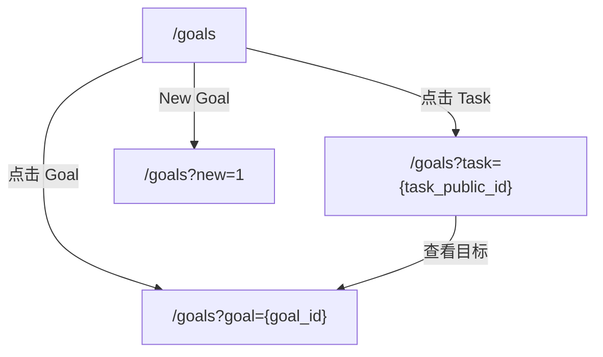

<!-- SPDX-License-Identifier: Apache-2.0 -->
## 用户需求
AI 时代的个人工作模式正在从“亲自做完”切换为“提出目标 + 组织多个 Agent 执行 + 作为 Reviewer 做判断”。在该模式下，瓶颈不再是单次执行能力，
而是**人的注意力带宽与上下文切换成本**：

- 人脑难以同时并行管理超过3个任务，很容易在频繁的上下文切换中耗尽心力。
- 用户同时推进多个目标与任务，容易陷入“下一步做什么”的决策疲劳。
- 多个 Agent 并行产出后，用户需要快速定位应优先 review 哪些结果、如何推动目标链继续向前。
- 当用户并行推进多任务时，需要能方便的“量化产出”，采用 Token消耗 或 Agent时 来量化吞吐。

## User Story

### Language Policy

- System specs may stay in Chinese.
- User-facing labels, buttons, navigation items, status text, and interaction copy must use English.
- Code implementation, comments, and API naming must use English.

### Dashboard

**概述**
Dashboard is the main workspace. It shows a goal list on the left, goal/task detail in the middle, and `What's Next` plus `Recent Events` on the right.

**Dashboard URI（路由）**
- `GET /goals`：Dashboard（左侧目标列表 + 中间详情 + 右侧辅助栏）。
- `GET /goals?goal={goal_id}`：在 Dashboard 中打开该目标详情（中间栏）。
- `GET /goals?task={task_public_id}`：在 Dashboard 中打开该任务详情（中间栏；左侧自动选中所属目标）。
- `GET /goals?new=1`：在 Dashboard 中直接打开 New Goal 对话框。

**视觉与交互**
1. 左侧栏只展示目标列表（用于扫视与选择目标），不在目标卡片下展开/展示 task。
   - Task 的查看与选择统一在中间详情里完成（例如在目标详情的 Tasks 表格中点击进入任务详情）。
2. Information density follows the current implementation:
   - Left goal cards show a truncated goal `title`, a done/total ratio, and a status dot.
   - Goal detail shows original `title`/`content`, DDL, elapsed time, related tasks, and related events.
   - Task detail shows original title/content, DDL, elapsed time, stable `taskId`, and related events.
   - Task status must remain visually distinguishable (`todo` / `in progress` / `done`).
3. Dashboard 采用纵向**三栏布局**：左侧「目标列表」+ 中间「详情」+ 右侧「辅助栏」。
   - 参考 ChatGPT/OpenAI 的页面体验：Dashboard 主体容器不滚动（或尽量不出现整页滚动条），滚动发生在各自栏内。
   - 左/中/右三栏必须**独立滚动**：滚动左侧不影响中/右，滚动中间不影响左/右。
   - 右侧辅助栏再分上下两栏：上栏是 What's Next，下栏是 Recent Events（事件流）。
   - 可用性强约束：任何一栏内容超过视口高度时，必须能在该栏内滚动（不能出现“三栏都无法滚动”的状态）。
   - 视觉强约束：滚动条样式需与整体 terminal/neon 风格统一（避免默认系统滚动条突兀）。
4. 键盘可用性（强约束）：Dashboard **整个界面**支持键盘方向键切换焦点移动。
  - `↑/↓`：在 Dashboard 内可见的可交互元素之间移动焦点（包括左侧目标/任务、中间详情按钮、右侧 What's Next / Recent Events 等）。
  - `←/→`：在左/中/右三栏之间移动焦点（优先选择与当前焦点纵向位置最接近的元素）。
  - 当焦点落在左侧目标/任务项上时，需同步切换中间详情。
5. 左侧栏只负责导航与状态概览：**不允许出现 Plan / Edit 等操作按钮**，所有编辑/规划/删除等操作统一放到中间详情页。
6. 顶部导航栏提供一个明显的 `New Goal` 按钮（弹窗/对话框均可），用于快速创建目标。
   - 视觉强约束：`New Goal` 必须与 `Dashboard/Memory/Companion` 同一套导航按钮样式。
   - 交互强约束（New Goal 形态升级）：
     - 对话框只包含：`Title`（必填，<=2000）+ `Content`（必填，<=4000）+ `DDL`（必填）。
     - `Title` 必须由用户或发布流程明确提供；OpenFocus 不再提供 `Auto` 开关，也不再通过 LLM/Agent 从 `Content` 自动提炼或生成 `Title`。
     - 必须移除 `gen` / `Auto generate from content` 等自动标题生成入口。
     - 顶部导航栏提供独立的 `Inspiration` 入口；`New Goal` 对话框内不再承载 `Plan Mode` 或其他规划入口。
     - 提交按钮固定显示为 `Save`；点击后立即创建 goal。
7. `Title`/`Content` 规则（强约束）：
  - Goal 和 Task 的用户语义字段只保留 `title` 与 `content`；不再维护独立 `summary` / `description` 语义。
  - Dashboard 左侧栏需要短展示时，只在渲染层截断 `title`（例如 20 字符左右）；截断只影响展示，不写回数据库，也不改变原始 `title`。
  - 系统不得在创建 Goal/Task 时调用 Agent/LLM 从 `content` 生成 `title` 或 `summary`。
8. Recent Events：
  - 事件按“越近越靠前”排序。
  - 事件项若关联 task，应支持一键跳转到该 task 的详情。
  - 事件数据必须来自真实 `events` 落库（不是前端假数据）。
  - 只对“能被系统识别到的有效 taskId（Task.public_id）”提供“打开”按钮，避免出现能点但打不开的事件。
   - 文案强约束：事件展示必须面向人阅读且使用英文：
     - 显示 `Source: Web` 或 `Source: Agent (name)`；不得出现 `agent: ui` 这类调试表达。
     - 事件类型使用 human-readable English labels（例如 `Result Report` / `Progress Report` / `Manual Finish` / `Reopen`），避免直接暴露内部 kind。
     - 状态需可读化（例如把 `status=succeeded` 展示为 `Completed (pending confirmation)`）。
9. 选中态视觉（强约束）：被选中的 goal/task **整张卡片框**必须高亮（不仅是文字/按钮高亮）。
10. 左侧信息密度（强约束）：
   - 左侧列表以“扫视”为主，状态/耗时等信息不得挤占 title 主信息区（避免出现「待启动/已进行」大段占位）。
   - 状态可以用小图标/颜色点位表达；详细状态/耗时在中间详情栏展开。
11. 完成确认（强约束）：
   - 外部 Agent/Skill 的“完成上报”（例如 `POST /api/agent/events` 的 `task.completed` 或 `POST /api/skills/focus_report` 的 `status=succeeded`）**不等于任务真实完成**。
   - 上报只会生成事件（用于历史/推荐/复盘），**不得自动把 Task 标记为 done**。
   - Task 是否完成必须由人确认：在 Task detail 里提供 `Finish` 按钮。
   - 已完成任务在 Task detail 里提供 `Reopen` 按钮，用于恢复到未完成状态。
   - 「任务详情」需要展示与该 task 相关的事件列表（最近若干条），用于用户复核 Agent 产出与上报内容。
12. 文案约束：避免出现调试风格的长句与键值对（例如 `status=... priority=... importance=... created ... ago`），页面只保留对用户有用的信息密度与更简洁的表达。

13. 新建 Task（交互强约束）：
   - 新建 Task 不允许在左侧 GOALS/TASKS 栏内直接输入创建；必须与 New Goal 一样通过弹窗/对话框创建。
   - 对话框包含 `Title` 与 `Content` 两个输入框，且**两个都必填**。
   - 保存成功后返回当前 goal 的 `Tasks` tab。
   - 点击保存后立即落库。

14. 目标详情编辑：
   - 目标详情需展示原始 `title` 与 `content`。
   - 支持在目标详情内编辑（不依赖跳转到单独编辑页）。
   - 如果 goal 来自 Inspiration，`inspiration` 链接展示在 DDL / elapsed / task count 所在 meta 行，小写小字体，以链接形式跳转。

15. 顶端导航栏提供 `Inspiration` 选项，点击后跳转到灵感空间列表页。
   - Inspiration 使用独立页面与独立 URL，不嵌在 `New Goal` 对话框里。
   - 顶部导航需同时保留 `New Goal` 与 `Inspiration` 两个入口，职责明确分离：前者负责立即创建，后者负责持续讨论与规划。

16. 顶端导航栏提供Companion选项，点击后跳转到Companion管理页。
    - Companion page shows current registered Companion basics: `name/device_id`, related AgentSpace list, created date, and status.
    - Companion statuses in the current product are: `active`, `offline`, and `waiting for pairing` (backend state key: `pending_certification`).
    - For waiting companions, the page shows an inline pairing code input plus `Pair` button inside each card.
    - Pairing code contains 10 letters or digits; each minute allows up to 10 attempts.

### Task's Agent Space

**概述**
AgentSpace is the task workspace. It binds one task to one workdir on one Companion. The current implementation stores `agent_type=trae-cli` and does not expose agent type selection in the create dialog.

**视觉与交互**
1. In Task detail, clicking `Create Space` opens a dialog to choose a workdir and a Companion.
   After AgentSpace creation succeeds, the page auto-jumps to AgentSpace. For tasks that already have a workspace, clicking `Space` opens AgentSpace.
   - Task 详情页的 `Create Space/Space` 左侧提供一个 `Goal` 按钮，用于跳回该 task 所属 goal。
2. AgentSpace uses the current three-column layout: `FILES` + `PREVIEW` + `TERMINAL`.
   - `FILES` is a read-only tree.
   - `PREVIEW` is read-only preview for code / markdown / image files.
   - `TERMINAL` is the remote terminal area.
3. 远程终端支持选项卡：
   - 点击右侧终端区的 `+` 创建一个新的终端 tab（每个 tab 对应一个独立的 PTY/session）。
   - 点击 tab 右上角的 `x` 关闭该终端（关闭后该 session 不再保留）。
   - 若该 AgentSpace 下没有任何终端且 Companion 在线，页面应自动创建一个默认终端。
4. 终端交互逻辑：
   - 用户在终端中输入命令，输入/输出以流式方式实时回显。
   - 终端默认以 AgentSpace 的工作目录作为启动目录（cwd=root_path）。
   - 终端 session 在 AgentSpace 生命周期内保留；若 Companion 重启/崩溃，允许终端 session 丢失。
   - Terminal area includes a `Prompt Zone` with `Agent Mode` toggle in the current implementation; it is not a separate Agent chat tab.
5. 释放工作区：
   - 点击“释放工作区”会释放该 AgentSpace，并清理该空间下的所有远程终端（以及 OpenFocus 侧的终端记录）。
   - 若 Companion 离线，允许清理仅发生在 OpenFocus 侧（终端可能在 Companion 上残留，但不影响 OpenFocus 侧继续使用）。
6. 使用Companion机制实现AgentSpace。

待定
1. 点击tui中的文件路径&行号能在FILES和PREVIEW里头跳转。

### Inspiration

**概述**
Inspiration is the dedicated ideation and planning module. It replaces `New Goal`'s old `Plan Mode` flow and provides persistent `InspirationSpace` workspaces for discussion, resource-assisted exploration, optional bring-your-own-agent terminal collaboration, draft iteration, and final publish.

**视觉与交互**
1. 顶部导航提供独立的 `Inspiration` 页面，采用：
   - `GET /inspirations`：Inspiration list
   - `GET /inspirations/{id}`：InspirationSpace detail
2. `Inspiration` 列表页展示全部灵感空间，并按 `open / published / closed` 分栏或筛选。
   - 各分栏默认按最近更新时间倒序。
   - 顶部提供明确的 `New Inspiration` 按钮。
   - 每张卡片至少展示：标题、状态、最近更新时间、消息轮次数、资源数量。
   - 对于已发布空间，卡片还需展示已生成的 goal 标题。
3. `New Inspiration` 创建空间时支持两种模式：
   - `Built-in Planner`：默认模式。使用 OpenFocus 内建的规划 agent，适合用户希望在 OpenFocus 内直接完成澄清、草案生成与发布。
   - `Bring Your Own Agent`：终端模式。OpenFocus 为该 InspirationSpace 创建独立 workspace，并在该 workspace 下开启 remote terminal；用户可在 terminal 中启动自己喜欢的 agent（Claude Code / Codex / Coco / Trae / shell script 等）。
   - 两种模式都共享同一个资源系统与发布流程；模式不是永久锁定，`open` 状态下允许从 built-in 模式开启 terminal，但关闭 terminal 不会丢失资源。
4. 每个 `InspirationSpace` 必须拥有独立工作目录。
   - 工作目录由 OpenFocus 自动创建与管理，不要求用户手动选择。
   - 工作目录下必须包含 `resources/` 子目录，所有可被用户/agent 读取的资源都以文件形式落在此目录下；数据库保存资源元信息、排序、软删除状态与审计信息。
   - 创建空间时，OpenFocus 必须把 title 与 first note 自动生成一个 Markdown 初始资源文件放入 `resources/`，并展示在 Resources 列表中。
   - remote terminal 的启动目录固定为该 InspirationSpace 工作目录，而不是项目根目录或 OpenFocus 运行目录。
   - 释放/删除未发布空间时，可以清理其 terminal session；workspace 是否物理删除由实现的安全策略决定，但 UI 必须清楚提示。
5. `InspirationSpace` 详情页根据模式采用 Apple/Geek 风的“工作台”布局：
   - 左侧 `Resources`：展示资源文件、摘要与同步状态。
   - 右侧主区域：`Built-in Planner` 模式显示内置讨论区与消息输入框；`Bring Your Own Agent` / terminal 模式下，原本内置 agent 的讨论区和输入框必须完全由 `Remote Terminal` 取代，不再展示 `Send`、`Suggest Titles`、`Generate Draft` 等内置 agent 交互入口。
   - terminal 模式只保留 terminal 内部 `Prompt Zone` 操作（`Summary`、`Create Goal`）以及生成后的 Draft/Publish 确认卡片；Draft 卡片是 OpenFocus 的结构化确认 UI，不是新的内置对话区。
   - terminal 模式不展示 `Agent Mode` 开关。
   - terminal 模式必须提供清晰的桥接按钮，而不是要求用户复制粘贴协议文本。
6. 创建空间时必须先手动填写标题。
   - 之后用户可通过消息输入区的 `/summary_title` 命令请求 agent 生成多个候选标题。
   - 标题候选以 assistant 消息内按钮的形式展示，用户点选后更新标题。
7. 资源系统支持 `url`、`image`、`text` 与 `summary` 资源。
   - `url` 资源在 V1 中只保存 URL 本身与名称。
   - `image` 资源在 V1 中只支持本地上传图片文件。
   - 文本、URL 与图片都必须在 workspace 的 `resources/` 目录下有可读文件表示；数据库保存路径与元信息。
   - 资源侧栏顶部提供统一的 `Add Resource` 入口，由用户选择 `URL / Image / Text`。
   - 资源列表按最近更新时间倒序。
8. `open` 状态下，每个资源默认提供以下操作：`Send to prompt`、`Preview`、`Rename`、`Delete`。
   - `Preview` 采用页内抽屉，不离开当前详情页。
   - `Send to prompt` 插入结构化引用，而不是直接把全文贴进输入框。
   - terminal 模式下，Resources 的 `Send` 按钮必须把资源内容注入当前 remote terminal 输入区，而不是写入内置消息 composer。
   - 资源删除后从列表消失，但对应上传/删除行为必须保留在审计与事件记录中。
9. Built-in Planner 模式的对话区采用持续会话模式，支持多轮讨论与历史回看；terminal 模式不显示该对话区。
   - 消息历史采用倒序分页加载。
   - 发送快捷键（强约束）：当输入框聚焦时，macOS 使用 `Cmd+Enter` 发送；其他平台使用 `Ctrl+Enter` 发送；单独 `Enter` 保持换行。
   - 等待 agent 回复期间必须展示明确的进行中状态，并锁定发送按钮/输入框，避免重复点击与误操作。
10. terminal 模式在 remote terminal 的 `Prompt Zone` 区提供 `Summary` 按钮。
   - 点击后，OpenFocus 必须直接向当前 remote terminal 注入一段结构化提示词文本，但不得自动发送 Enter；不需要 preview sheet 或二次确认。
   - 提示词要求 terminal 内的 agent 阅读当前 workspace 与 `resources/`，然后创建或更新 `resources/draft_summary.md`。
   - `draft_summary.md` 是自定义 agent 与 OpenFocus goal 生成 agent 的桥接文件，必须使用 Markdown：一级标题是 goal title，一级标题下方是 goal content；每个 task 使用一个二级标题，二级标题下方是 task content。
   - OpenFocus 需要在资源栏 `Add Resource` 下方提供 `Sync Resource`，或提供自动轮询能力，扫描 workspace 的 `resources/` 目录并刷新 Resources 栏；其中 `resources/draft_summary.md` 识别为名称固定为 `Summary` 的 `summary` 资源，其他文件按类型同步为普通资源。
   - 这个动作只生成桥接资源，不创建 Goal/Task，也不把 InspirationSpace 标记为 `published`。
   - terminal agent 是“不受信协作者”：它可以在 workspace 中产出文件，但不能直接写入 Goal/Task，也不能绕过 OpenFocus 的草案生成与发布确认链路。
11. 用户可通过 `/draft_goal_tasks` 或 `Generate Draft`（built-in 模式）生成新的 `Draft vN`；terminal 模式的草案生成入口不得放在 terminal header 中。
   - terminal 模式下，`Prompt Zone` 的 `Create Goal` 先让用户在输入框中手动输入或从下拉栏选择一个 resource 文件，再以该 resource 作为主输入生成 OpenFocus 可确认的结构化草案；它只负责把 terminal agent 的 Markdown 产物转换成 OpenFocus 可确认的结构化草案，不恢复内置 agent 对话体验。
   - 如果缺少 `Summary`，相关草案生成入口必须提示用户先生成或同步 summary。
   - built-in 模式下，每次草案作为一条 assistant 消息写入消息流，并显示版本号（例如 `Draft v1`、`Draft v2`）。
   - terminal 模式下，草案以独立 Draft/Publish 卡片显示在 terminal 工作台下方，不显示普通内置 agent 消息流。
12. `Draft vN` 的 assistant 消息需要渲染结构化确认卡片。
   - 卡片展示候选 goal 与 tasks。
   - tasks 默认全选，用户可取消不需要的 task 后再发布。
   - 确认卡片本身只负责确认，不支持直接编辑 goal/task 内容；若用户想修改内容，需要继续对话并让 agent 重新生成新草案。
   - 未勾选的 tasks 视为本次 `deferred`，需要体现在发布结果与发布总结中。
13. 正式发布通过 assistant 草案卡片内的 `Publish` 完成，而不是通过聊天口令确认。
   - 发布固定产出 `1 个 goal + 多个被勾选的 tasks`。
   - 发布前不得写入任何 Goal/Task（人类在环）。
   - 发布失败时，原草案卡片需直接显示错误并允许用户原地重试。
14. 发布成功后，`InspirationSpace` 进入 `published` 状态并永久只读。
   - 系统必须生成一个新的只读资源，名称固定为 `Published Summary`；若本次发布来自 terminal 模式的 `Summary`，则 `Published Summary` 应基于最终 `Draft vN` 与用户勾选结果生成，而不是复用或覆盖 `Summary`。
   - `Published Summary` 至少包含：`Idea`、`Why now`、`Goal`、`Published tasks`、`Open questions`、`Rejected / deferred ideas`。
   - 已发布空间头部需展示发布时间、goal 跳转链接与 task 数量。
15. `closed` 表示暂停/封存，而不是废弃。
   - `closed` 空间详情页提供 `Reopen`。
   - 对于未发布空间，`closed` 详情页还提供 `Delete`；删除前做简单二次确认。
16. `published` 空间不可 reopen；若要基于当前结果继续思考，必须使用 `Fork New Inspiration`。
   - Fork 出的新空间默认带一个 follow-up 风格标题。
   - 新空间默认继承上一版的 `Published Summary` 资源，并允许用户选择附带部分原始资源。
   - 继承过来的 `summary` 默认只出现在资源区，不自动注入首轮 prompt；是否发送由用户决定。

### Calendar

**概述**
Calendar 用于按“月”查看完成记录（task.confirmed_done）与目标时间线（goal created → due）。

**视觉与交互**
1. 顶部导航栏在 `Companion` 后追加 `Calendar` 按钮，点击后弹出日历对话框（不跳转页面）。
2. Calendar 提供两种 `by month` 视图：
   - `Month`：常规矩形月历；每一天展示“当天完成的任务数”，点击某一天在下方列出当天完成的任务，可点击任务跳转到 `/goals?task={task_public_id}`。
   - `Swimlane`：泳道图（横轴=该月日期，每行=一个 goal 的时间区间 created_at → due_date），点击 goal 打开该 goal 下所有 tasks 列表；支持 `Back` 返回泳道图。

### What's Next

**概述**
`What's Next` 升级为一个 `Next Move Agent`。它不是简单的单条规则推荐，而是一个会读取全量上下文的推荐 Agent：可获取用户所有 `goals`、`tasks`、`events`、当日 `daily memory`、`MEMORY.md`、显式用户偏好，以及用户对历史推荐的反馈，并基于这些信息给出下一步建议。

**视觉与交互**
1. 每当目标或任务的状态发生变化、时间过去了30分钟或用户主动进行刷新，就要进行一次分析。
2. 推荐结果展示在 Dashboard 右侧上栏（`What's Next`），展示形态升级为 **3 个 task recommendation cards**。
   - 每张卡至少包含：Task 标题、所属 Goal、预计耗时、任务类型、推荐理由、`Open` 按钮、`Not for now` 按钮。
   - 推荐理由必须面向人类可读，避免暴露调试字段或原始打分细节。
3. Next Move Agent 的输入必须覆盖以下信号：
   - 所有进行中/未完成的 Goals 与 Tasks。
   - 与这些任务相关的 Events（用于判断最近是否刚推进过、是否存在连续上下文）。
   - 用户偏好与记忆（来自 `daily memory` 与 `MEMORY.md`）。
   - 用户对历史推荐的显式反馈（尤其是“不喜欢/不适合现在”的理由）。
4. Next Move Agent 的推荐逻辑必须综合考虑：
   - 任务类型（例如深度思考型、沟通协调型、机械执行型、Review 型）。
   - 预计耗时（短平快任务 vs. 需要大块专注时间的任务）。
   - 上下文切换成本（是否延续当前正在推进的目标、主题、工作区、文件上下文）。
   - 任务重要度、优先级、DDL 风险。
   - 用户长期偏好（例如偏好快速反馈、连续推进同类任务、避免碎片切换等）。
5. What’s Next **一次返回 3 个推荐 task**（强约束）：
   - 不是 1 个，也不是无限列表。
   - 3 个推荐之间需要有排序，但不要求强行完全不同；Agent 可以在“延续当前上下文”与“覆盖不同工作模式”之间做平衡。
6. 用户可以对任意一个推荐点击 `Not for now` 并填写理由。
   - 理由既支持预设选项，也支持补充自由文本。
   - Agent 必须对这些反馈进行总结学习，并在后续推荐中主动规避相同问题。
7. 学习结果不能只停留在当次交互内。
   - 反馈结论必须沉淀为可复用的偏好/反偏好信号，供后续 Next Move 推荐持续读取。
8. 强约束：推荐结果中不得出现已删除、已完成、已归档、无效打开的 task。
9. 强约束：如果当前上下文不足以给出高质量推荐，Agent 也应返回 3 个候选，但要在理由中明确表达不确定性，而不是返回空白区域。

### Memory

**概述**
Memory uses a three-layer markdown system: `audit memory`, `daily memory`, and `long-term memory`.

**视觉与交互**
1. Memory 页面展示三个主视图：`Audit`、`Daily` 与 `Long-term`。
   - `Audit` shows rolling audit files grouped by time window.
   - `Daily` shows the current `YYYY-MM-dd.md` file or a selected historical daily file.
   - `Long-term` shows `MEMORY.md`.
   - The page layout, typography, and color system should align with the Dashboard style baseline.
2. Audit memory must be visible in the Memory page in MVP.
   - The UI may present audit logs by file list, time range, or rolling segments.
   - The UI does not need to flatten all audit files into one infinite stream.
3. Audit memory must include all key behaviors from users and agents inside OpenFocus:
   - Goal / Task create, edit, `Finish`, delete
   - Inspiration interaction history, including messages, resource operations, draft generation, publish, reopen, and fork
   - Agent / Skill reports
   - All web shell inputs and outputs in AgentSpace
4. Audit memory rotates automatically when either threshold is reached:
   - `1 hour`
   - `2000 entries`
5. Every audit rotation triggers a summary job.
   - The generated summary is appended into that day's `daily memory`.
   - After each summary finishes, the system must immediately roll a brand new audit file for subsequent logs.
   - The Audit tab must provide a `Summary` button so the user can manually trigger the same summary-and-roll flow.
   - Audit files that already produced a summary must be visually marked in the file list so they are distinguishable from files that have not been summarized.
   - Audit memory files keep a `7 days` TTL.
6. After `00:00`, the system starts a daily finalization job for the previous day.
   - It reads the whole previous day's daily memory draft.
   - It writes back the finalized version to the same `YYYY-MM-dd.md` file.
   - It extracts stable user preferences and facts into `MEMORY.md`.
7. `daily memory` and `MEMORY.md` are permanent files and have no TTL.
8. Recommendation and planning may read both the latest daily memory and `MEMORY.md`, but the UI must keep user-facing text in English.
9. `Long-term` is read-only by default.
   - The primary action shows `Edit` by default.
   - Only after clicking `Edit` does the text area become editable and the action switch to `Save`.
