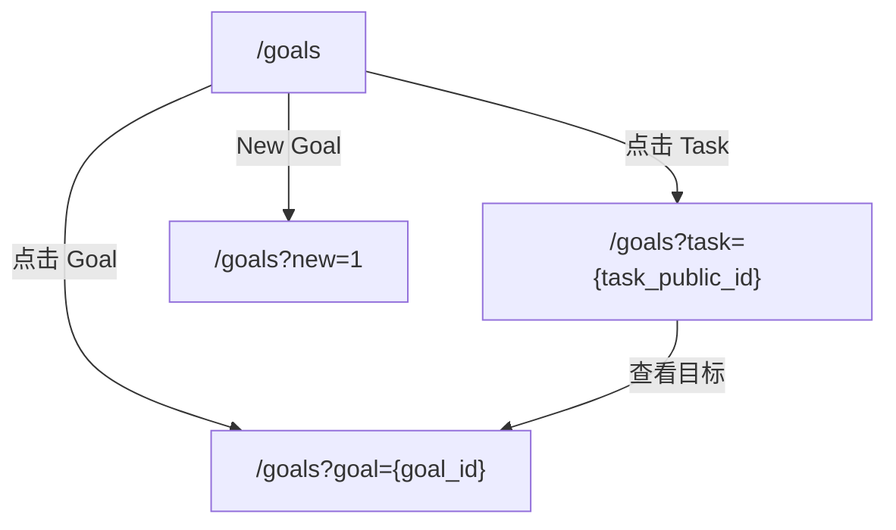

## 用户需求
AI 时代的个人工作模式正在从“亲自做完”切换为“提出目标 + 组织多个 Agent 执行 + 作为 Reviewer 做判断”。在该模式下，瓶颈不再是单次执行能力，
而是**人的注意力带宽与上下文切换成本**：

- 人脑难以同时并行管理超过3个任务，很容易在频繁的上下文切换中耗尽心力。 
- 用户同时推进多个目标与任务，容易陷入“下一步做什么”的决策疲劳。
- 多个 Agent 并行产出后，用户需要快速定位应优先 review 哪些结果、如何推动目标链继续向前。
- 用户需要看到清晰的进展与历史成就（大量 TODO 被勾选），并量化“杠杆效应”：真实耗时 vs Agent 消耗。

## User Story

### Dashboard

**概述**
通过Dashboard清晰展示正在推进的目标与并行执行的任务。 每个目标与任务都要包含：摘要、当前进度、已经进行的时间、DDL。

**Dashboard URI（路由）**
- `GET /goals`：Dashboard（左侧目标列表 + 中间详情 + 右侧辅助栏）。
- `GET /goals?goal={goal_id}`：在 Dashboard 中打开该目标详情（中间栏）。
- `GET /goals?task={task_public_id}`：在 Dashboard 中打开该任务详情（中间栏；左侧自动选中所属目标）。
- `GET /goals?new=1`：在 Dashboard 中直接打开 New Goal 对话框。

**视觉与交互**
1. 左侧栏只展示目标列表（用于扫视与选择目标），不在目标卡片下展开/展示 task。
   - Task 的查看与选择统一在中间详情里完成（例如在目标详情的 Tasks 表格中点击进入任务详情）。
2. 目标与任务都要包含：摘要、当前进度、已经进行的时间、DDL。通过详情页展示目标与任务的详细内容。已经完成的、 正在进行的、
   还未开始的任务要有不同且明显的状态展示。
3. Dashboard 采用纵向**三栏布局**：左侧「目标列表」+ 中间「详情」+ 右侧「辅助栏」。
   - 参考 ChatGPT/OpenAI 的页面体验：Dashboard 主体容器不滚动（或尽量不出现整页滚动条），滚动发生在各自栏内。
   - 左/中/右三栏必须**独立滚动**：滚动左侧不影响中/右，滚动中间不影响左/右。
   - 右侧辅助栏再分上下两栏：上栏是 What's Next，下栏是 Recent Events（事件流）。
   - 可用性强约束：任何一栏内容超过视口高度时，必须能在该栏内滚动（不能出现“三栏都无法滚动”的状态）。
   - 视觉强约束：滚动条样式需与整体 terminal/neon 风格统一（避免默认系统滚动条突兀）。
4. 键盘可用性（强约束）：Dashboard **整个界面**支持键盘方向键切换焦点移动。
  - `↑/↓`：在 Dashboard 内可见的可交互元素之间移动焦点（包括左侧目标/任务、中间详情按钮、右侧 What's Next / Recent Events 等）。
  - `←/→`：在左/中/右三栏之间移动焦点（优先选择与当前焦点纵向位置最接近的元素）。
  - 当焦点落在左侧目标/任务项上时，需同步切换中间详情。
5. 左侧栏只负责导航与状态概览：**不允许出现 Plan / Edit 等操作按钮**，所有编辑/规划/删除等操作统一放到中间详情页。
6. 顶部导航栏提供一个明显的 `New Goal` 按钮（弹窗/对话框均可），用于快速创建目标。
   - 视觉强约束：`New Goal` 必须与 `Dashboard/Memory/Companion` 同一套导航按钮样式。
   - 交互强约束（New Goal 形态升级）：
     - 对话框包含：`Title`（goal content, <=2000）+ `Content`（详细描述, 必填）+ `DDL`（必填）。
     - `Auto` 开关必须放在 `Title` 输入框右侧：
        - `Auto=ON`：`Title` 不允许输入（只读），并显示 `Auto generate from content`。
       - `Auto=OFF`：`Title` 才允许输入。
       - 必须移除 `gen` 按钮（不再通过按钮生成 Title）。
     - `Plan Mode` 行为（交互强约束）：
       - 对话框底部提供 `Plan Mode` 开关。
       - `Plan Mode=ON`：提交按钮文案显示为 `Plan`；点击后进入 Plan 流程，不在此处直接创建 goal（由 Plan Mode 的 `Accept` 写库）。
       - `Plan Mode=OFF`：提交按钮文案显示为 `Save`；点击后立即创建 goal。
       - 顶部导航栏不提供单独的 Plan Mode 按钮。
7. 「摘要」规则（强约束）：
  - Goal/Task 创建时：若原文长度超过 20 个字，必须使用 LLM 生成一个**不超过 20 个字**的中文摘要；否则摘要=原文。
  - Dashboard 左侧栏只展示摘要（节省空间，便于扫视）；原文只在中间详情栏展示。
  - 摘要用于展示，不改变原文内容。
8. Recent Events：
  - 事件按“越近越靠前”排序。
  - 事件项若关联 task，应支持一键跳转到该 task 的详情。
  - 事件数据必须来自真实 `events` 落库（不是前端假数据）。
  - 只对“能被系统识别到的有效 taskId（Task.public_id）”提供“打开”按钮，避免出现能点但打不开的事件。
   - 文案强约束：事件展示必须面向人阅读：
     - 显示「来源：Web 操作」或「来源：Agent（name）」；不得出现 `agent: ui` 这类调试表达。
     - 事件类型需翻译成中文短标题（例如“执行结果上报/进度上报/人工确认完成/重新打开”），避免直接暴露 `skill.focus_report`、`task.reopened` 等内部 kind。
     - 状态需可读化（例如把 `status=succeeded` 展示为“已完成（待确认）”）。
9. 选中态视觉（强约束）：被选中的 goal/task **整张卡片框**必须高亮（不仅是文字/按钮高亮）。
10. 左侧信息密度（强约束）：
   - 左侧列表以“扫视”为主，状态/耗时等信息不得挤占摘要主信息区（避免出现「待启动/已进行」大段占位）。
   - 状态可以用小图标/颜色点位表达；详细状态/耗时在中间详情栏展开。
11. 完成确认（强约束）：
   - 外部 Agent/Skill 的“完成上报”（例如 `POST /api/agent/events` 的 `task.completed` 或 `POST /api/skills/focus_report` 的 `status=succeeded`）**不等于任务真实完成**。
   - 上报只会生成事件（用于历史/推荐/复盘），**不得自动把 Task 标记为 done**。
   - Task 是否完成必须由人确认：在「任务详情」里提供 `标记完成` 按钮。
   - 已完成任务在「任务详情」里提供 `reopen/重新打开` 按钮，用于恢复到未完成状态。
   - 「任务详情」需要展示与该 task 相关的事件列表（最近若干条），用于用户复核 Agent 产出与上报内容。
12. 文案约束：避免出现调试风格的长句与键值对（例如 `status=... priority=... importance=... created ... ago`），页面只保留对用户有用的信息密度与更简洁的表达。

13. 新建 Task（交互强约束）：
   - 新建 Task 不允许在左侧 GOALS/TASKS 栏内直接输入创建；必须与 New Goal 一样通过弹窗/对话框创建。
   - 对话框包含「任务标题」与「详细描述」两个输入框，且**两个都必填**。
   - 允许用户只写「详细描述」，通过按钮「从详细描述生成」调用 LLM 提炼「任务标题」（<=512 字）。
   - 点击保存后立即落库。

14. 目标详情编辑：
   - 目标详情需展示目标与详细描述原文。
   - 支持在目标详情内编辑（不依赖跳转到单独编辑页）。

15. 顶端导航栏提供Companion选项，点击后跳转到Companion管理页。
    - Companion状态页要显示当前已经注册上来的Companion的基本信息，包括：ip、companion当前关联的
      AgentSpace与Task、这个companion的状态等。
    - Companion的状态包括：active、offline、pending certification。对于待认证的companion，还要有一个输入认证码的框，用于输入
      companion侧产生的认证码，待companion侧确认后才能连接。认证码包含10位字母或数字，每分钟刷新一次，每尝试一次后也会刷新一次，每分钟最多
      可以输入3次。
    - 交互约束：只有 `pending certification` 的 companion 卡片内展示配对输入框与 `Pair` 按钮；每个待配对 companion 对应一组输入框+按钮（不使用全局的 Pair 输入区）。

### Task's Agent Space

**概述**
AgentSpace是task的agent工作区，它包含一个工作目录和一个agent进程，其中工作目录就是本地agent的启动目录。每一个task在创建后，用户都可以为
task指定一个工作目录并创建一个agent，目前支持的agent包括：trae-cli(coco) 和 codex。

**视觉与交互**
1. 在Task详情页点击“创建工作区”来新建一个AgentSpace，点击后弹出一个对话框用于选择一个本地目录作为工作目录、选择一个agent类型、选择一个
   Companion环境。在AgentSpace创建成功后，自动跳转到AgentSpace页面。对于已经有工作区的task，点击“进入工作区”来跳转AgentSpace页面。
   - Task 详情页的 `Create Space/Space` 左侧提供一个 `Goal` 按钮，用于跳回该 task 所属 goal。
2. AgentSpace页面和trae、cursor的页面布局一致，左侧是目录导航+文件内容预览（只能预览不能编辑），右侧是一个远程终端（Remote Terminal）。
   - 右侧面板提供 `Terminal/Agent` 两个 tab：Terminal 用于 TUI/命令执行；Agent 用于查看/发送对话消息（基于 AgentSession）。
3. 远程终端支持选项卡：
   - 点击右侧终端区的 `+` 创建一个新的终端 tab（每个 tab 对应一个独立的 PTY/session）。
   - 点击 tab 右上角的 `x` 关闭该终端（关闭后该 session 不再保留）。
   - 若该 AgentSpace 下没有任何终端且 Companion 在线，页面应自动创建一个默认终端。
4. 终端交互逻辑：
   - 用户在终端中输入命令，输入/输出以流式方式实时回显。
   - 终端默认以 AgentSpace 的工作目录作为启动目录（cwd=root_path）。
   - 终端 session 在 AgentSpace 生命周期内保留；若 Companion 重启/崩溃，允许终端 session 丢失。
5. 释放工作区：
   - 点击“释放工作区”会释放该 AgentSpace，并清理该空间下的所有远程终端（以及 OpenFocus 侧的终端记录）。
   - 若 Companion 离线，允许清理仅发生在 OpenFocus 侧（终端可能在 Companion 上残留，但不影响 OpenFocus 侧继续使用）。
6. 使用Companion机制实现AgentSpace。

待定
1. 点击tui中的文件路径&行号能在FILES和PREVIEW里头跳转。

### PlanMode

**概述**
Plan Mode 用于“先规划再创建”：在用户确认（Accept）之前，不写入 Goal/Tasks。

**视觉与交互**
1. Plan Mode 的入口在 `New Goal` 对话框：打开 `Plan Mode` 开关后，点击 `Plan` 不创建 goal，直接进入 Plan 流程。
   - 不在左侧列表上放按钮。
   - 顶部导航栏不提供 Plan Mode 按钮。
2. 页面流转（强约束）：`Input → Planning → Plan Ready → Accept/Edit/Retry/Cancel`。
   - Input：输入 goal 草稿 + DDL，点击 `Generate Plan` 创建一个 plan session。
   - Planning：等待 agent 输出期间必须展示明确的进行中状态，并锁定发送按钮/输入框，避免重复点击与误操作。
   - Plan Ready：agent 给出可执行 steps 后，必须进入“人类确认”区。
     - `Accept`：写入 Goal/Tasks 并回到 Dashboard。
     - `Edit`：允许在页面内直接编辑 step 标题（不写库，直到 Accept）。
     - `Retry`：重新生成一份 plan（新 session）。
     - `Cancel`：放弃并返回 Dashboard。
   - 强约束：在 `Accept` 之前不得写入任何 task（人类在环）。
3. 对话的实现参考 ChatGPT/豆包：等待大模型时必须有提示，且不能继续发送/编辑输入内容（避免“无提示 + 可重复点击”这种反人类交互）。
   - 发送快捷键（强约束）：当输入框聚焦时，macOS 使用 `Cmd+Enter` 发送；其他平台使用 `Ctrl+Enter` 发送；单独 `Enter` 保持换行。

### Calendar

**概述**
Calendar 用于按“月”查看完成记录（task.confirmed_done）与目标时间线（goal created → due）。

**视觉与交互**
1. 顶部导航栏在 `Companion` 后追加 `Calendar` 按钮，点击后弹出日历对话框（不跳转页面）。
2. Calendar 提供两种 `by month` 视图：
   - `Month`：常规矩形月历；每一天展示“当天完成的任务数”，点击某一天在下方列出当天完成的任务，可点击任务跳转到 `/goals?task={task_public_id}`。
   - `Swimlane`：泳道图（横轴=该月日期，每行=一个 goal 的时间区间 created_at → due_date），点击 goal 打开该 goal 下所有 tasks 列表；支持 `Back` 返回泳道图。

### What's Next

**概述**
“推荐下一步”是openfocus的核心功能！它通过一个agent loop来分析当前的目标与任务情况，结合用户当前的状态、用户的偏好、当前的时间等自动推荐
下一步做什么。

**视觉与交互**
1. 每当目标或任务的状态发生变化、时间过去了30分钟或用户主动进行刷新，就要进行一次分析。
2. 推荐下一步的结果要展示在 dashboard 右侧上栏（What's Next），点击后可以展开详情，看到推荐的原因与背后的思考，并支持一键打开对应目标/任务详情。
3. What’s Next **一次只给一个推荐**（强约束）：
   - 展示形式为一句话：`建议下一步去完成任务A，因为xxx。`
   - 不允许同时推荐多个任务让用户选择（避免把决策疲劳转移到推荐列表）。

### Memory

**概述**
openfocus内置一套记忆系统，它通过分析历史事件、交互来形成用户画像与用户记忆，从而更好的实现 PlanMode & 推荐下一步。

**视觉与交互**
1. 记忆系统仿照openclaw的memory-core模式设计，使用markdown文件存储。
2. 页面上要提供选项卡展示当前的User Card与User Memory，允许用户进行编辑。
